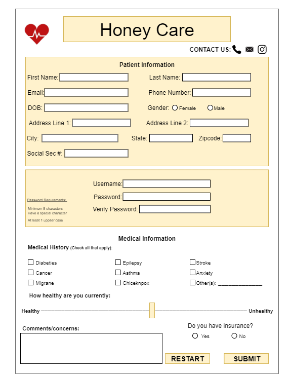

# HoneyCare
Transactional Processing Project: Creating a patient care form

Before building the website, we had to make a template to show how we wanted our form to look:   

### **Description:**
This project represents a cumulative four-part web development series, where each assignment systematically built upon the previous one to create an increasingly sophisticated and user-friendly form application.

⋆ A1 Foundation:  
Established the core structure with HTML, CSS, and JavaScript, implementing a basic functional form with flexible styling and interactivity.  
_link A1: https://suhanispace.w3spaces.com/mis3371/hw1.patient-form.html_

⋆ A2 Validation & Review:  
Enhanced the form by introducing user-friendly validation, preventing submission if required fields were left blank. Added secure handling of sensitive data (like SSN) using onblur validation and a review feature, allowing users to double-check their information before submitting.  
_link A2: https://suhanispace.w3spaces.com/hw2.patient-form.html_

⋆ A3 Strict Validation & Guided Workflow:  
Introduced strict formatting rules (e.g., phone number as xxx-xxx-xxxx) and a validation button to highlight missing or incorrect fields. The submit button was disabled until all inputs passed validation, ensuring data completeness and accuracy.  
_link A3: https://suhanispace.w3spaces.com/mis3371/hw3.patient-form.html_

⋆A4 Enhanced UX & Persistence:  
Added a sticky/fixed header for better navigation, integrated external content via iFrames, and implemented storage and cookies to remember user inputs—when the “Remember me” option is selected—creating a seamless, returning-user experience.  
_link A4: https://suhanispace.w3spaces.com/hw4.patient-form.html_

### What I learned & how I could've improved  
This project was a deep dive into front-end development, where I applied HTML, CSS, and JavaScript—from foundational principles to advanced interactivity. I gained a new appreciation for the intricate details that shape user experience, realizing how much complexity lies behind even the simplest web elements. While I’m proud of the final result, I recognize opportunities for refinement, such as improving the visual layout through better-aligned input fields and fine-tuning the sticky footer to ensure it stays within the viewport without overflow.

